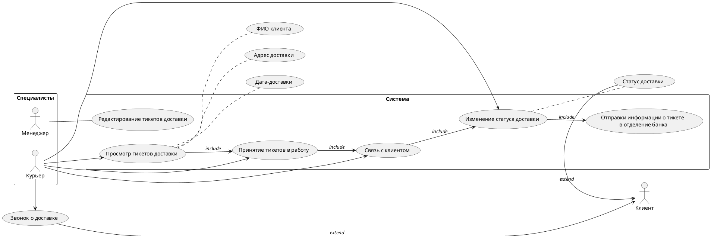
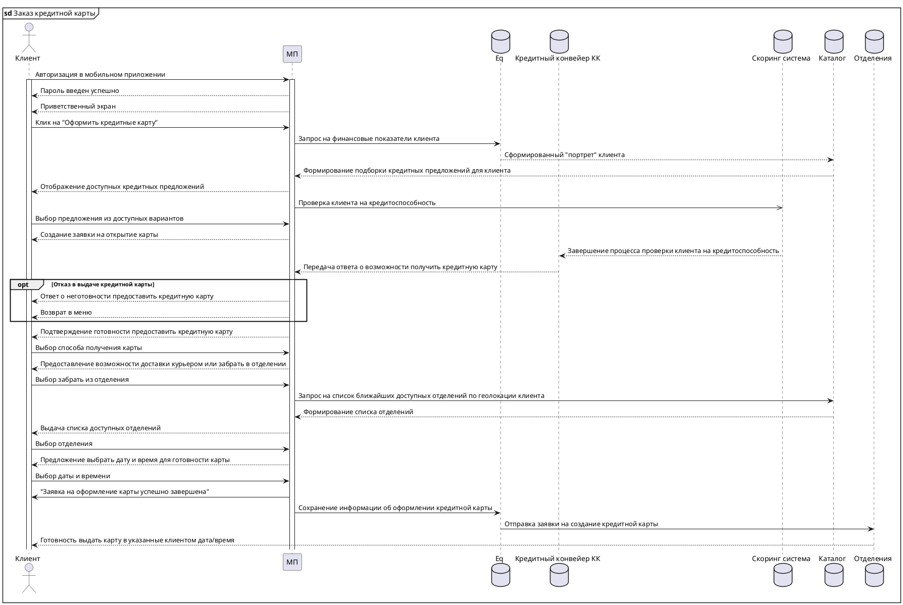

# Домашнее задание 4 UML

## Use Case

```plantuml

@startuml
left to right direction
skinparam packageStyle rectangle
Package Специалисты {
Actor "Менеджер" as m
Actor "Курьер" as d
}
Actor "Клиент" as c 

'Package Специалисты {d; c}

Rectangle Система {
usecase "Просмотр тикетов доставки" as UC1
usecase "Принятие тикетов в работу" as UC2
usecase "Связь с клиентом" as UC3
usecase "Редактирование тикетов доставки" as UC4
usecase "Изменение статуса доставки" as UC5
usecase "Отправки информации о тикете \nв отделение банка" as UC6
}
(ФИО клиента) as Name
(Адрес доставки) as Address
(Дата-доставки) as Date
(Звонок о доставке) as Call
(Статус доставки) as Status

d -> UC1
UC1 -down-> UC2 : //include//
d -> UC2
UC2 -down-> UC3 : //include//
UC5 -down-> UC6 : //include//
d -> UC3
UC3 -down-> UC5 : //include//
d -down-> UC5

m -- UC4
UC1 .. Name
UC1 .. Address
UC1 .. Date
UC5 .. Status
Status -> c : //extend//
d -> Call
Call -> c : //extend//

@enduml
```

## Sequence

```plantuml
@startuml

mainframe **sd** Заказ кредитной карты 
actor Клиент as Cl
participant МП as App
database Eq as S
database "Кредитный конвейер КК" as CC
database "Скоринг система" as SS
database Каталог as Cat
database Отделения as Deps

Cl -> App : Авторизация в мобильном приложении
activate Cl
activate App
App --> Cl : Пароль введен успешно
App --> Cl: Приветственный экран
Cl -> App : Клик на "Оформить кредитные карту"
App -> S : Запрос на финансовые показатели клиента
S --> Cat : Сформированный "портрет" клиента
Cat --> App : Формирование подборки кредитных предложений для клиента
App --> Cl : Отображение доступных кредитных предложений
App ->> SS : Проверка клиента на кредитоспособность
Cl -> App : Выбор предложения из доступных вариантов
App --> Cl : Создание заявки на открытие карты
SS --> CC : Завершение процесса проверки клиента на кредитоспособность
CC --> App : Передача ответа о возможности получить кредитную карту
opt Отказ в выдаче кредитной карты
App --> Cl : Ответ о неготовности предоставить кредитную карту
App --> Cl : Возврат в меню
end
App --> Cl : Подтверждение готовности предоставить кредитную карту
Cl -> App : Выбор способа получения карты
App --> Cl : Предоставление возможности доставки курьером или забрать в отделении
Cl -> App : Выбор забрать из отделения
App -> Cat : Запрос на список ближайших доступных отделений по геолокации клиента
Cat --> App : Формирование списка отделений
App --> Cl : Выдача списка доступных отделений
Cl -> App : Выбор отделения
App --> Cl : Предложение выбрать дату и время для готовности карты
Cl -> App : Выбор даты и времени
App -> Cl : "Заявка на оформление карты успешно завершена"
App -> S : Сохранение информации об оформлении кредитной карты
S -> Deps : Отправка заявки на создание кредитной карты
Deps --> Cl : Готовность выдать карту в указанные клиентом дата/время
@enduml
```
